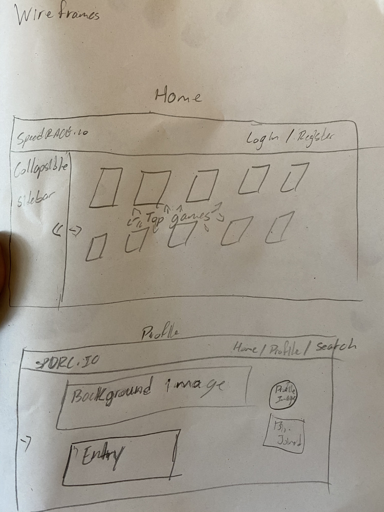
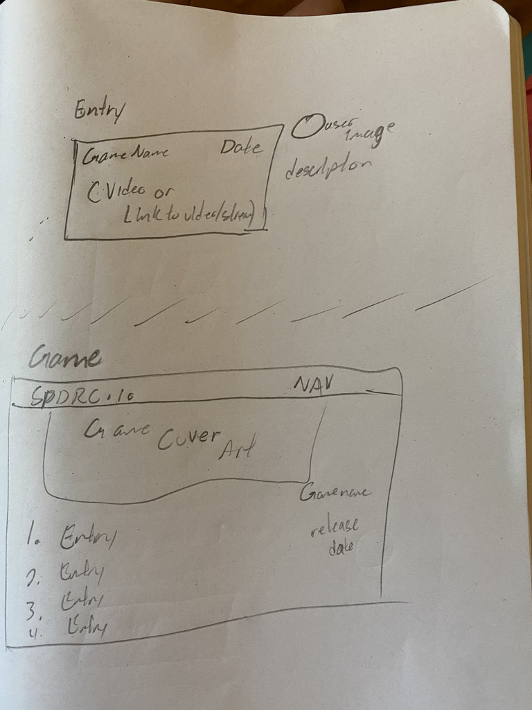
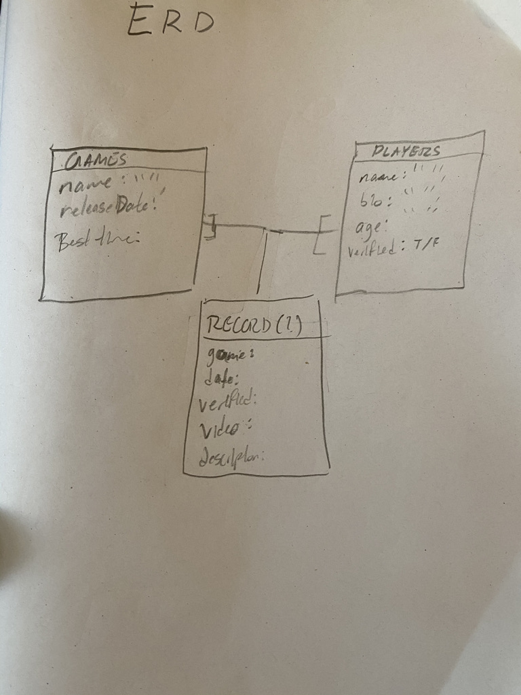

<<<<<<< HEAD
# SpeedRace.io

https://speedraceio.herokuapp.com/

Welcome to Speedrace.io, the #1 place to record your speedrunning stats for every game out there.

On our site, a user will be able to create a profile, with which they will interact with our wide index of games, most commonly sorted by highest amount of entries. They will also be able to add a profile image, games they would like to follow, other SpeedRacers they may like to follow, and have the ability to make entries. These entries will be shown on the view page for each game, or the profile page for each user, they are associated with. 

Entries will be small, card-like elements which contain information about the gamer (their SpeedRacer profile, twitch/twitter/youtube links, etc.), the game being played, links to the stream where it happened, a short description of the circumstances surrounding the video, and the completion statistics such as time, percentage, hits taken, etc. These entries can be about anything from Super Mario 64 speedruns, to Dark Souls no damage runs, to World of Warcraft world-first boss kills!

## Technologies and Development
This program uses the Django/Python stack. Speedracer runs queries to an SQL database to bring most accurate data on speedruns.
To run this program as a developer, simply clone down this repo and 

## User Stories
- A young gamer wants to get into speedrunning, but doesn't know much about it besides some live streams. On SpeedRace.io, they will be able to search all their favorite games and more, seeing a list of all the top records for each!

- A veteran ultra-hard mode gamer has been running through their favorite game more time than they can recount, and they are absolutely sure they're the best in the world at this point. With SpeedRace.io, our veteran can create a profile and log his gameplay stats for all the recognition and bragging rights.

- An MMORPG guild is looking for top talent to help slay the new big boss coming to the game soon. The current recruitment methods are stagnating, and the officers would rather be playing the game than recruiting anyhow. From their SpeedRace.io account, however, they can see the new "top players" in any game they choose to follow, and reach out to those players (with those players' permission of course!) 

## Wireframes

## ERD

In the future, the app will support video players (complete with timestamps) on the site to view the record breaking event and a moderation team to review and verify such entries.
=======
# SpeedRacer
A place for gamers to record their high scores. SpeedRacer - Beat That!
>>>>>>> speedrace/main
